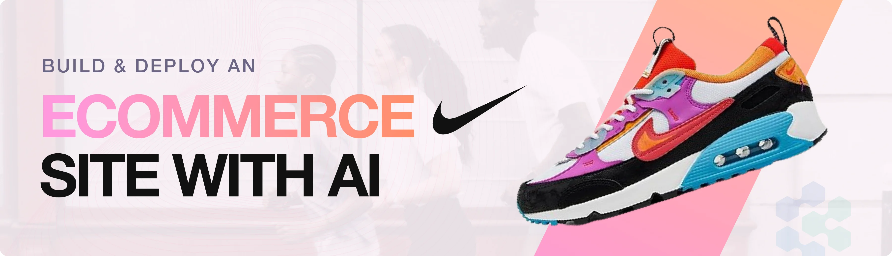
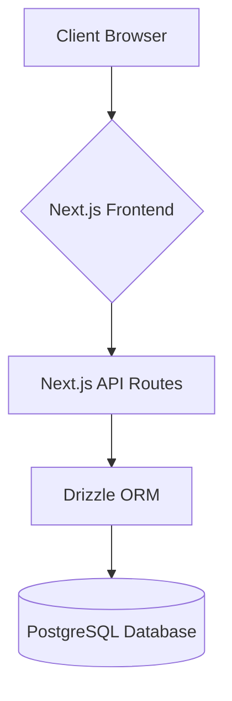
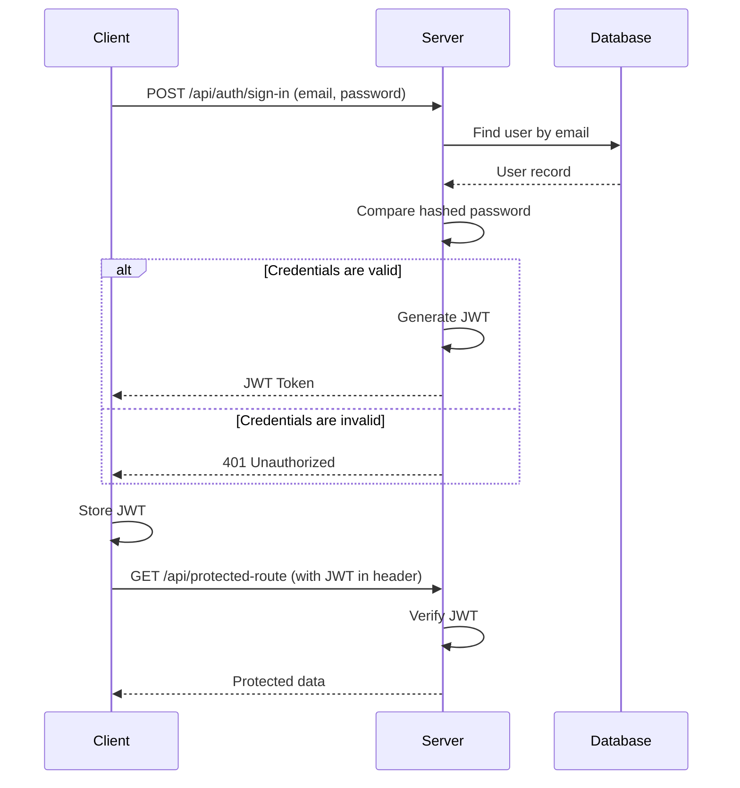

# Nike Store - Your Ultimate Destination for Athletic Footwear

A full-featured, responsive e-commerce application built with Next.js, TypeScript, and Tailwind CSS, designed for a seamless user shopping experience.

[](https://opensource.org/licenses/MIT)
[](https://nextjs.org/)
[](https://www.typescriptlang.org/)
[](https://tailwindcss.com/)
[](https://orm.drizzle.team/)

### **[Live Demo](https://your-live-demo-link.com)**

---



## Table of Contents

- [About The Project](#about-the-project)
- [Tech Stack](#tech-stack)
- [Architecture and Flow](#architecture-and-flow)
- [Features](#features)
- [Getting Started](#getting-started)
  - [Prerequisites](#prerequisites)
  - [Installation](#installation)
- [Environment Variables](#environment-variables)
- [Challenges & Learnings](#challenges--learnings)
- [License](#license)
- [Contact](#contact)

## About The Project

This project was built to demonstrate proficiency in full-stack development with a focus on modern, type-safe technologies. It serves as a complete, real-world example of an e-commerce application, showcasing skills in server-side rendering with Next.js, database management with Drizzle ORM, and state management with Zustand.

## Tech Stack

| Category      | Technology Used           | Rationale (Why you chose it)                                                              |
| ------------- | ------------------------- | ----------------------------------------------------------------------------------------- |
| Frontend      | Next.js (React)           | Server-side rendering for performance, file-based routing, and a rich ecosystem.          |
| Backend       | Next.js API Routes        | Integrated backend capabilities within the Next.js framework for a monolithic setup.      |
| Database      | PostgreSQL (via Neon)     | A powerful, open-source object-relational database system with a strong reputation for reliability. |
| ORM           | Drizzle ORM               | A lightweight, TypeScript-first ORM that provides excellent type safety and performance.  |
| State Mgt     | Zustand                   | A small, fast, and scalable state-management solution using a minimalistic API.           |
| Styling       | Tailwind CSS              | A utility-first CSS framework for rapid and consistent UI development.                    |
| Auth          | better-auth               | A simple and effective authentication library for Next.js applications.                   |
| Deployment    | Vercel                    | Seamless deployment and integration specifically designed for Next.js applications.       |

## Architecture and Flow

### High-Level Architecture

The application follows a client-server model integrated within the Next.js framework. The Next.js frontend communicates with the Next.js API routes, which in turn interact with a PostgreSQL database via the Drizzle ORM.



### User Authentication Flow



## Features

- 🛍️ **Full User Authentication**: Register, Login, and Logout functionality.
- 🔍 **Product Browsing**: Search, pagination, and filtering by gender.
- 📄 **Product Collections**: View curated product collections.
- 🛒 **Shopping Cart**: Add, remove, and update items in the cart.
- 📞 **Contact Page**: A dedicated page for user inquiries.

## Getting Started

To get a local copy up and running, follow these simple steps.

### Prerequisites

- Node.js (v18 or higher)
- npm or yarn
- A PostgreSQL database (e.g., from [Neon](https://neon.tech/))

### Installation

1.  **Clone the repository:**
    ```sh
    git clone https://github.com/SKV-io-495/nike-store.git
    ```
2.  **Navigate to the project directory:**
    ```sh
    cd nike-store
    ```
3.  **Install dependencies:**
    ```sh
    npm install
    ```
4.  **Set up environment variables:**
    Create a `.env` file in the root of the project and add the required variables (see below).
5.  **Run database migrations:**
    ```sh
    npm run db:push
    ```
6.  **Seed the database (optional):**
    ```sh
    npm run db:seed
    ```
7.  **Start the development server:**
    ```sh
    npm run dev
    ```

## Environment Variables

Create a `.env` file in the root directory and add the following variables. You can use the `.env.example` file as a template.

```
DATABASE_URL="your_postgresql_connection_string"
```

## Challenges & Learnings

One of the main challenges was ensuring end-to-end type safety from the database to the frontend. By using Drizzle ORM with TypeScript, I was able to create a highly maintainable and robust application where the data models are consistent across the entire stack. This significantly reduced runtime errors and improved the developer experience.

## License

Distributed under the MIT License.

## Contact

LinkedIn: [https://www.linkedin.com/in/sumitverma-495t0f](https://www.linkedin.com/in/sumitverma-495t0f)

